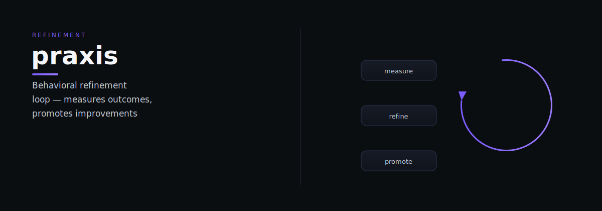

# praxis

praxis — Praxis: behavioral refinement loop — measures skill outcomes against baselines and promotes improvements.

> Tell it what you need. It does the work.

## What it does

Praxis is a bounded behavioral refinement loop. It records execution outcomes, measures them against established baselines, and generates refinement signals when performance drifts or improved approaches are discovered. Results flow through journals to Corvus and Mentor for pattern analysis and improvement proposals.

## Dependencies

- All skills — reads journals for outcome data
- [Corvus](https://github.com/indigokarasu/corvus) — receives BehavioralSignal files
- [Mentor](https://github.com/indigokarasu/mentor) — receives performance data

---

*Praxis is part of the [OCAS Agent Suite](https://github.com/indigokarasu).*

---

*praxis is part of the [OCAS Agent Suite](https://github.com/indigokarasu).*